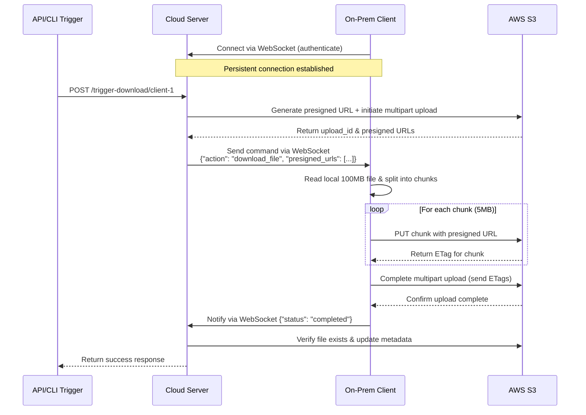

# 🧩 Software Engineer – Home Assignment

## 🧭 My Approach

### Overview

The core challenge in this scenario is **NAT traversal**, the server cannot directly access clients that reside inside private networks.  
Therefore, the design must enable **reverse communication**, initiated by the client.

My chosen approach uses a **persistent reverse connection** using **WebSocket** (via Go's `gorilla/websocket` package) combined with **AWS S3 presigned URLs** for efficient file transfer.  
This hybrid approach allows the server to communicate with on-premise clients in real-time without requiring inbound connections, while offloading the actual file transfer to AWS S3 for better scalability and resumability.

**Key Innovation**: When the server triggers a download, it generates a presigned S3 URL and sends it to the client via WebSocket. The client then uploads the file **directly to S3** using multipart upload, avoiding server bandwidth bottlenecks.

### Key Design Principles

| Principle                   | Implementation                                                                               |
| --------------------------- | -------------------------------------------------------------------------------------------- |
| **Reverse connectivity**    | Each client initiates a WebSocket connection to the cloud server.                            |
| **Command-based control**   | The server can send commands (JSON messages) to specific connected clients.                  |
| **Decoupled file transfer** | File upload is done **directly to AWS S3** using presigned URLs, bypassing server bandwidth. |
| **Resumable uploads**       | S3 multipart upload allows chunked transfer with resume capability for 100MB files.          |
| **Scalability**             | WebSocket connections tracked in memory/Redis; S3 handles unlimited concurrent uploads.      |
| **Security**                | Token-based auth on WebSocket; time-limited presigned URLs (15 min expiry) for S3 uploads.   |
| **Extensibility**           | The same architecture can be adapted for other commands (e.g., sync, health-check, metrics). |

---

## 🏗️ Architecture

### 1. System Components

| Component   | Description                                                                                      |
| ----------- | ------------------------------------------------------------------------------------------------ |
| **Server**  | Cloud-hosted application that manages client connections and orchestrates file downloads via S3. |
| **Client**  | On-premise agent that connects to the server and uploads files directly to S3 when commanded.    |
| **Storage** | AWS S3 bucket with presigned URL support for secure, direct uploads from clients.                |

---

### 2. Communication Flow



---

### 3. API and Socket Overview

| Endpoint                        | Method    | Description                                    |
| ------------------------------- | --------- | ---------------------------------------------- |
| `/ws/connect`                   | WebSocket | Client establishes persistent connection       |
| `/trigger-download/{client_id}` | POST      | Trigger client to start uploading file to S3   |
| `/status/{client_id}`           | GET       | Check client connection status and last upload |
| `/uploads/{upload_id}`          | GET       | Get upload status and S3 object details        |

---

### 4. Data Format

#### WebSocket Message (Server → Client)

```json
{
  "action": "download_file",
  "file_path": "/data/report.bin",
  "upload_config": {
    "upload_id": "abc123xyz",
    "bucket": "my-app-uploads",
    "key": "uploads/client-1/report.bin",
    "chunk_size": 5242880,
    "presigned_urls": [
      {
        "part_number": 1,
        "url": "https://my-app-uploads.s3.amazonaws.com/...?X-Amz-Signature=..."
      },
      {
        "part_number": 2,
        "url": "https://my-app-uploads.s3.amazonaws.com/...?X-Amz-Signature=..."
      }
    ],
    "expires_at": "2025-11-01T10:30:00Z"
  }
}
```

#### WebSocket Message (Client → Server)

```json
{
  "status": "completed",
  "upload_id": "abc123xyz",
  "file_name": "report.bin",
  "size": 104857600,
  "parts": [
    { "part_number": 1, "etag": "\"abc123...\"" },
    { "part_number": 2, "etag": "\"def456...\"" }
  ],
  "upload_duration_ms": 3450
}
```

#### Error Response (Client → Server)

```json
{
  "status": "failed",
  "upload_id": "abc123xyz",
  "error": "file_not_found",
  "message": "File /data/report.bin does not exist"
}
```

---

### 5. Tech Stack

| Layer                    | Technology                         | Description                              |
| ------------------------ | ---------------------------------- | ---------------------------------------- |
| **Language**             | Go 1.22+                           | High-performance, concurrent runtime     |
| **Web Framework**        | `net/http` + `gorilla/websocket`   | Native HTTP + WebSocket support          |
| **Client Library**       | `gorilla/websocket`, `http.Client` | Reliable for outbound and streaming      |
| **Cloud Storage**        | AWS S3                             | Scalable object storage with multipart   |
| **AWS SDK**              | AWS SDK for Go v2                  | S3 presigned URLs & multipart upload     |
| **File Upload Strategy** | S3 Multipart Upload                | Chunked, resumable, parallel uploads     |
| **Auth**                 | Bearer Token (JWT)                 | Lightweight authentication for WebSocket |
| **Containerization**     | Docker / Docker Compose            | Easy demo setup with LocalStack for S3   |

---

### 6. Scalability Considerations

| Concern                 | Solution                                                        |
| ----------------------- | --------------------------------------------------------------- |
| High number of clients  | Maintain connection map in Redis or distributed memory          |
| File upload performance | Use S3 multipart upload with parallel chunk uploads             |
| Large file handling     | 100MB file split into 20 chunks (5MB each) uploaded in parallel |
| Connection drop         | Reconnect logic with exponential backoff                        |
| Upload resume           | S3 multipart upload allows resuming from last completed chunk   |
| Bandwidth optimization  | Direct S3 upload bypasses server, eliminating bandwidth limits  |
| Storage scalability     | S3 auto-scales, no disk space concerns                          |
| Monitoring              | Add `/metrics` endpoint (Prometheus) + CloudWatch for S3        |
| Cost optimization       | S3 Intelligent-Tiering for infrequent access files              |

---

### 7. Demo and Execution

#### Prerequisites

```bash
# Set AWS credentials (or use LocalStack for local testing)
export AWS_ACCESS_KEY_ID=your_access_key
export AWS_SECRET_ACCESS_KEY=your_secret_key
export AWS_REGION=us-east-1
export S3_BUCKET_NAME=my-app-uploads
```

#### Server

```bash
go run ./server/main.go
```

#### Client

```bash
go run ./client/main.go --client-id=restaurant-1 --file=/data/report.bin --server-url=ws://localhost:8080
```

#### Trigger Download via API

```bash
curl -X POST http://localhost:8080/trigger-download/restaurant-1 \
  -H "Authorization: Bearer <token>"
```

#### Trigger Download via CLI

```bash
go run ./cli/main.go download --client-id=restaurant-1
```

#### Check Upload Status

```bash
curl http://localhost:8080/status/restaurant-1
```

---

## 📂 Repository Structure

```
.
├── server/
│   ├── main.go              # Server entry point
│   ├── websocket/
│   │   ├── handler.go       # WebSocket connection handler
│   │   └── manager.go       # Client connection manager
│   ├── api/
│   │   ├── handler.go       # REST API handlers
│   │   └── middleware.go    # Auth middleware
│   ├── s3/
│   │   ├── client.go        # S3 client wrapper
│   │   ├── presign.go       # Presigned URL generation
│   │   └── multipart.go     # Multipart upload orchestration
│   └── models/
│       └── message.go       # Message structs
├── client/
│   ├── main.go              # Client entry point
│   ├── websocket/
│   │   ├── client.go        # WebSocket client
│   │   └── handler.go       # Message handler
│   ├── uploader/
│   │   ├── s3.go            # S3 uploader
│   │   ├── chunker.go       # File chunking logic
│   │   └── resume.go        # Resume capability
│   └── config/
│       └── config.go        # Client configuration
├── cli/
│   └── main.go              # CLI tool for triggering downloads
├── shared/
│   ├── auth/
│   │   └── token.go         # JWT token utilities
│   └── models/
│       └── protocol.go      # Shared protocol definitions
├── docker-compose.yml       # LocalStack S3 + Server + Client
├── go.mod
├── go.sum
├── .env.example
├── MY_APPROACH.md
└── README.md
```

---

## 🔒 Security Highlights

- All communication over **HTTPS / WSS** in production.
- Each client authenticates using a **JWT token** on WebSocket connection.
- **Presigned URLs** are:
  - Time-limited (15-minute expiry by default)
  - Scoped to specific S3 object key
  - Require specific HTTP method (PUT only)
  - Cannot be reused after expiration
- File uploads validated by client ID and upload session.
- S3 bucket configured with:
  - Private ACL (no public access)
  - Encryption at rest (AES-256)
  - Versioning enabled for audit trail
- Optional **mTLS** for enterprise deployments.
- Server validates file completion by checking S3 object metadata.

---

## ✅ Summary

This solution provides a **real-time, scalable, and secure** communication channel between the server and on-premise clients, leveraging **AWS S3** for efficient file transfer.

The server can **trigger and receive file uploads on demand** without requiring inbound access to client networks, while completely offloading the bandwidth-intensive file transfer to AWS infrastructure.

### Key Highlights:

✅ **NAT-safe** using outbound WebSocket connections  
✅ **Real-time** command delivery via persistent WebSocket  
✅ **Scalable** - S3 handles unlimited concurrent uploads, server only orchestrates  
✅ **Efficient** - 100MB files uploaded in parallel chunks (5MB each)  
✅ **Resumable** - S3 multipart upload allows resume from last chunk  
✅ **Secure** - Time-limited presigned URLs with JWT authentication  
✅ **Production-ready** - Industry best practice for client-to-cloud file transfer  
✅ **Cost-effective** - Server bandwidth costs eliminated

### Architecture Benefits:

| Benefit                 | Description                                                               |
| ----------------------- | ------------------------------------------------------------------------- |
| **Terminology Clarity** | "Download" from server perspective is implemented as reverse upload to S3 |
| **Bandwidth Offload**   | Server handles only control plane; S3 handles data plane                  |
| **Fault Tolerance**     | Client can retry individual chunks without re-uploading entire file       |
| **Observability**       | S3 CloudWatch metrics + server-side upload tracking                       |
| **Extensibility**       | Same pattern works for bidirectional sync, backups, logs, etc.            |

### Alternative Approaches Considered:

| Approach                     | Pros                               | Cons                            | Decision          |
| ---------------------------- | ---------------------------------- | ------------------------------- | ----------------- |
| Direct HTTP POST to Server   | Simple                             | Server bandwidth bottleneck     | ❌ Not scalable   |
| SSH Reverse Tunnel           | No external deps                   | Complex setup, not cloud-native | ❌ Hard to manage |
| VPN / Tailscale              | True peer-to-peer                  | Requires network-level changes  | ❌ Too invasive   |
| **WebSocket + S3 Presigned** | **Scalable, resumable, efficient** | **Requires S3**                 | ✅ **Selected**   |

---

**End of Document**
